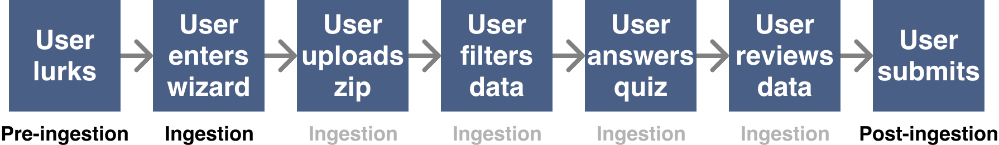

To our knowledge, no one has scaled open source data donation, especially when it comes to location or symptom data.
There are several ongoing efforts to collect contact tracing data, but they are rife with privacy issues
that will surface in months to years from now.

The best way to resolve these issues proactively is to solve them in the open. It starts with a simple, but
important goal:

<h1>Give users complete visibility and control over data at all stages.</h1>

## What is visibility?
Data visibility is the ability of the user to see the [structure](./CONTACT_TRACING_DATASET_FORMAT.md) and content of their data.

## What is control?
Data control is the ability to decide the lifecycle of their data. Should data exist, or should it not? When a researcher is approved, should data be used, or should it be withheld?

## What stages are there?

### User stages

| Stage | Description |
| --- | --- |
| Pre-Ingestion | The user visits the home page, GitHub repo, etc |
| Ingestion | The user enters the ingestion wizard |
| Ingestion > Uploading | The user uploads a zip file |
| Ingestion > Filtering | The user removes personally identifiable data points |
| Ingestion > Answering | The user answers optional questions about symptoms |
| Ingestion > Review | The user reviews all data prior to submission |

### Researcher stages

| Stage | Description |
| --- | --- |
| Pre-Vetting | The researcher visits the home page, GitHub repo, etc |
| Vetting | The researcher request access to data via email, and provides proof that they satisfy the requirements. Core contributors review provided proof |
| Accepted | The researcher satisfies the requirements. A message is sent to the community introducing the researcher, describing the research, and providing a 24 hour window to remove data |
| Researching | The researcher gains access to the data |
| Post-Research | The researcher is done using the data |

# Principles

## Principle 1: Securely transmit as little information over the Internet as possible

### Summary
Only send what is necessary for tracing, and do so securely.
### Rationale
- Location and medical data must be safe in transit and at rest.
### Execution

| Stages | Description | State |
| --- | --- | --- |
| Pre-ingestion, during ingestion, post ingestion | All external communication done over HTTPS | Done |
| Pre-ingestion, during ingestion, post ingestion | All exposed endpoints have DoS protection and SPI | Done |
| Pre-ingestion, during ingestion, post ingestion | All data is encrypted at rest | Done |
| During ingestion | Epi-Collect parses the Google Takeout zip file locally in the browser | Not Done |
| During ingestion | Filtering step of the wizard allows users to remove sensitive data points | Done |

To be continued
