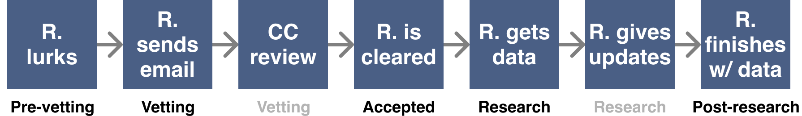

To our knowledge, no one has scaled open source data donation, especially when it comes to location or symptom data.
There are several ongoing efforts to collect contact tracing data, but they are rife with privacy issues
that will surface in months to years from now.

The best way to resolve these issues proactively is to solve them in the open. It starts with a simple, but
important goal:

<h1>Give users complete visibility and control over data at all stages.</h1>

## What is visibility?
Data visibility is the ability of the user to see the [structure](./CONTACT_TRACING_DATASET_FORMAT.md) and content of their data.

## What is control?
Data control is the freedom to decide the lifecycle of their data. Should data exist, or should it not? When a researcher is approved, should data be used, or should it be withheld?

## What stages are there?

### User stages

| Stage | Description |
| --- | --- |
| Pre-Ingestion | The user visits the home page, GitHub repo, etc |
| Ingestion | The user enters the ingestion wizard |
| Ingestion > Uploading | The user uploads a zip file |
| Ingestion > Filtering | The user removes personally identifiable data points |
| Ingestion > Answering | The user answers optional questions about symptoms |
| Ingestion > Review | The user reviews all data prior to submission |

### Researcher stages

| Stage | Description |
| --- | --- |
| Pre-Vetting | The researcher visits the home page, GitHub repo, etc |
| Vetting | The researcher request access to data via email, and provides proof that they satisfy the requirements. Core contributors review provided proof |
| Accepted | The researcher satisfies the requirements. A message is sent to the community introducing the researcher, describing the research, and providing a 24 hour window to remove data |
| Researching | The researcher gains access to the data |
| Post-Research | The researcher is done using the data |

# Principles

## Principle 1: Securely transmit as little information over the Internet as possible

### Summary
Only send what is necessary for tracing, and do so securely.
### Rationale
- Location and medical data must be safe in transit and at rest.
### Execution

| Stages | Description | State |
| --- | --- | --- |
| Pre-ingestion, during ingestion, post ingestion | All external communication done over HTTPS | Done |
| Pre-ingestion, during ingestion, post ingestion | All exposed endpoints have DoS protection and SPI | Done |
| Pre-ingestion, during ingestion, post ingestion | All data is encrypted at rest | Done |
| During ingestion | Epi-Collect parses the Google Takeout zip file locally in the browser | Not Done |
| During ingestion | Filtering step of the wizard allows users to remove sensitive data points | Done |

## Principle 2: The user knows what information was uploaded at all times

### Summary
The user must, at all times, know exactly what data they’ve contributed.
### Rationale
- Most users will be surprised to see their own Google location data for the first time. So it is important that they feel safe and have control over it once imported into the tool.
- We will need to help them make their assessment by suggesting areas to place geofences (such as home and work).
### Execution

| Stages | Description | State |
| --- | --- | --- |
| During ingestion | The Filter Data Points page includes a map and timeline of each data point | Done |
| During ingestion | The Filter Data Points page includes helpful hints as to what may be personally identifiable data | Not Done |
| Post-ingestion |  The View Ingestion Token page shows all uploaded data points and quiz answers | Not Done, unclear if this is better than avoiding to send the data over the wire again |

## Principle 3: Allow users to delete data at any time

### Summary
The user must have the ability to delete data at all times.
### Rationale
- Location data is extremely sensitive. If users don’t properly scrub the data, or have doubt about whether they did it properly post-ingestion, they should be able to remove it from the data set.
- Local laws often require that Internet companies give users the option to delete data.
### Execution

| Stages | Description | State |
| --- | --- | --- |
| During ingestion | The user can exit the wizard without any location or medical data being stored on our servers | Done |
| Post-ingestion | The Ingestion Confirmation page provides the user with a hard-to-guess password to delete location data. Optionally user can have an email sent to them with the trace password | Not Done |

## Principle 4: Store as little data as possible

### Summary
Omission of data is the best way to make it difficult to identify a user.
### Rationale
- It should be impossible to identify a user from data points or the questionnaire.
- In the absolute worst case scenario, the damage from unintended data exposure should be inconsequential.
### Execution

| Stages | Description | State |
| --- | --- | --- |
| During ingestion | Do not send data points or quiz answers until the user has completed the very last step of the wizard | Done |
| Pre-ingestion, during ingestion, post-ingestion | Do not store email address, phone numbers, name, address, or any personally identifiable information | Done |
| Post-ingestion | If Epi-Collect doesn’t find a researcher to use the dataset by May 1st, 2020, all ingested data will be deleted | Done |

## Principle 5: Notify users about each data usage

### Summary
This ensures the user knows the data still exists and has real-world consequences.
### Rationale
- Most users forget that their data exists, and usually never find out about its impact unless there’s a breach.
- Some users may have a change of heart about the usage of their data post-ingestion.
- Researchers don’t have a way to express gratitude to anonymous data donors. Reminders and updates can do that.

### Execution

| Stages | Description | State |
| --- | --- | --- |
| User post-ingestion, researcher accepted | Send an update to the mailing list introducing the researcher and describing their work | Done |
| User post-ingestion, researcher researching, researcher post-research | Send an update to the mailing list with research progress and conclusions | Not Done |
