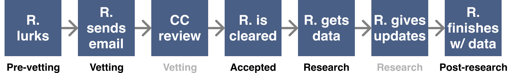

# Information for researchers

If you or your research group would like to work with Epi-Collect data, or you are in a health-related field and want to influence the direction of Epi-Collect, we would love to talk with you.
Please email us at nessup@gmail.com and mennen.lars@gmail.com. We also encourage you to join the public
[Slack workspace](https://join.slack.com/t/epi-collect/shared_invite/zt-d24uxjzl-7oT5ljZwRc74VMgozPwAqg).

### What we can help with
- Integrating the dataset into your tooling
- Creating new quiz questions
- Creating new types of data input
- Creating a location-specific dataset (such as for a hospital in a given locale)
- Sharing your work with our partners and community

## Overall process

### Requirements

- Researcher must prove affiliation with an accredited educational institution of higher learning
  - Acceptable academic accreditations:
    - Researcher is currently a graduate student in a health-related field
    - Researcher is formerly or currently a faculty member
    - Researcher is an undergrad acting with the support of a research group
  - Researcher must receive unanimous approval from the Core Contributors (Danny and Lars) after reviewing accreditation
  - Researcher must then introduce themselves to community and communicate what they would like to do with the data

### Post approval

- Epi-Collect Users are notified that the researcher has received the data and can delete in 24 hours
- After 24 hours notice delivered to users, their data is copied into the researcher's dataset
- We send users regular updates on your work and related work
- Researcher must sign document affirming data will only be used for stated purpose
